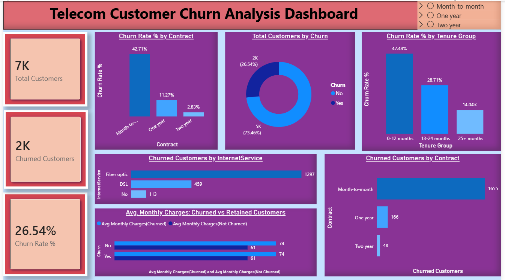
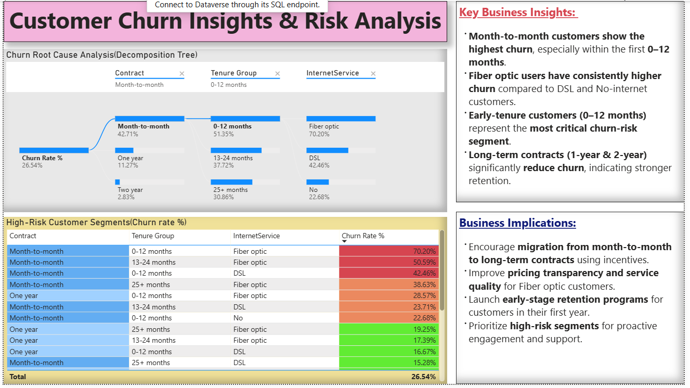
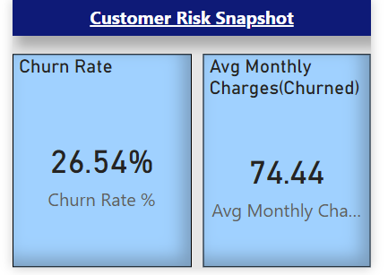

# 📊 Customer Churn Analysis – Power BI Dashboard

## 📌 Project Overview
This project focuses on analyzing **customer churn behavior** using a telecom dataset.  
The goal is to identify **high-risk customer segments**, understand **key churn drivers**, and provide **actionable business insights** through an interactive **Power BI dashboard**.

This project is designed to demonstrate my skills in:
- Data analysis
- Business understanding
- Power BI dashboard design
- Insight-driven storytelling

---

## 🗂 Dataset Information
- **Dataset Name:** Telco Customer Churn Dataset  
- **Source:** IBM Sample Dataset  
- **Records:** ~7,000 customers  
- **Key Attributes:**
  - Customer demographics
  - Contract type
  - Tenure
  - Internet services
  - Monthly charges
  - Churn status

---

## 🎯 Key KPIs
- **Total Customers**
- **Churned Customers**
- **Churn Rate (%)**
- **Average Monthly Charges (Churned Customers)**

---

## 📊 Dashboard Pages

### 1️⃣ Customer Churn Overview
- Overall churn rate
- Total vs churned customers
- Churn distribution by:
  - Contract type
  - Tenure group
  - Internet service

📷 *Preview:*  

---

### 2️⃣ Insights & Risk Analysis
- Identification of **high-risk customer segments**
- Churn rate comparison across:
  - Month-to-month vs long-term contracts
  - Early tenure vs long tenure customers
  - Fiber optic vs DSL users
- Root cause analysis using **Decomposition Tree**

📷 *Preview:*  

---

### 3️⃣ Tooltip Analysis
- Interactive tooltips for deeper insights
- Hover-based KPI comparison
- Contextual churn metrics without cluttering the dashboard

📷 *Preview:*  

---

## 🔍 Key Business Insights
- **Month-to-month customers** show the highest churn, especially within the **first 12 months**
- **Early tenure customers (0–12 months)** are the most critical churn-risk segment
- **Fiber optic users** have consistently higher churn compared to DSL and no-internet users
- **Long-term contracts (1–2 years)** significantly reduce churn, indicating stronger customer retention

---

## 💡 Business Recommendations
- Encourage migration from **month-to-month to long-term contracts**
- Improve onboarding and engagement during the **first year of customer tenure**
- Review pricing and service quality for **fiber optic customers**
- Launch targeted retention programs for high-risk segments

---

## 🛠 Tools & Technologies Used
- **Power BI**
- **DAX**
- **Microsoft Excel**
- **Data Modeling & Visualization**
- **Business Analytics Concepts**

---

## 📁 Repository Structure
